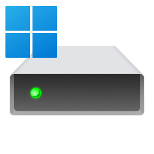
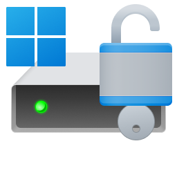
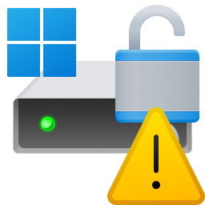

# Bitlocker disk encryption

From 2024 onwards, unless I'm mistaken, the Pro version may feature the Windows BitLocker feature,
 which indicates that your system volume is encrypted to protect data.

You can check this through `Settings > Privacy & security > Device encryption > BitLocker drive encryption`,
 or through `Control Panel > System and Security > BitLocker Drive Encryption`.

If the Microsoft Windows operating system storage drive appears with `Turn on BitLocker`,
 the error related to optimizing the size of dynamic disk images is likely due to a different source.

<table>
  <tr>
    <td valign="middle">
      
    </td>
    <td valign="middle">
      <ul>
        <li>Turn on BitLocker</li>
      </ul>
    </td>
  </tr>
</table>

However, if one of the following images appears, it will be necessary to decrypt it
 to avoid conversion errors when trying to access the drive.
 
<table>
  <tr>
    <td valign="middle">
      
    </td>
    <td valign="middle">
      <ul>
        <li>Suspend protection</li>
        <li>Back up your recovery key</li>
        <li>Turn off BitLocker</li>
      </ul>
    </td>
  </tr>
</table>

In this case, we choose `Turn off BitLocker`. After responding to the message,
 we have a reasonable amount of time during which the decryption process will take place.
 After this operation, the operating system's storage unit will be as shown 
 in the first case, with `Turn on BitLocker`.

<table>
  <tr>
    <td valign="middle">
      
    </td>
    <td valign="middle">
      <ul>
        <li>Turn on BitLocker</li>
      </ul>
    </td>
  </tr>
</table>

In this case, we only have the `Turn on BitLocker` option. After responding to the message,
 we have a series of screens, during which we have to print the recovery key.
 I advise printing it using the third option. But a few screens later,
 we will have the option

<table>
  <tr>
    <td valign="middle">
      
    </td>
    <td valign="middle">
      <ul>
        <li>Back up your recovery key</li>
        <li>Turn off BitLocker</li>
      </ul>
    </td>
  </tr>
</table>

where we interrupt (operation `Close`) and choose `Turn off BitLocker`, as in the second option.
